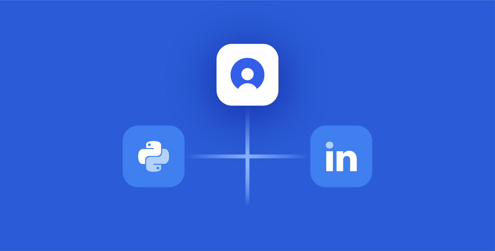
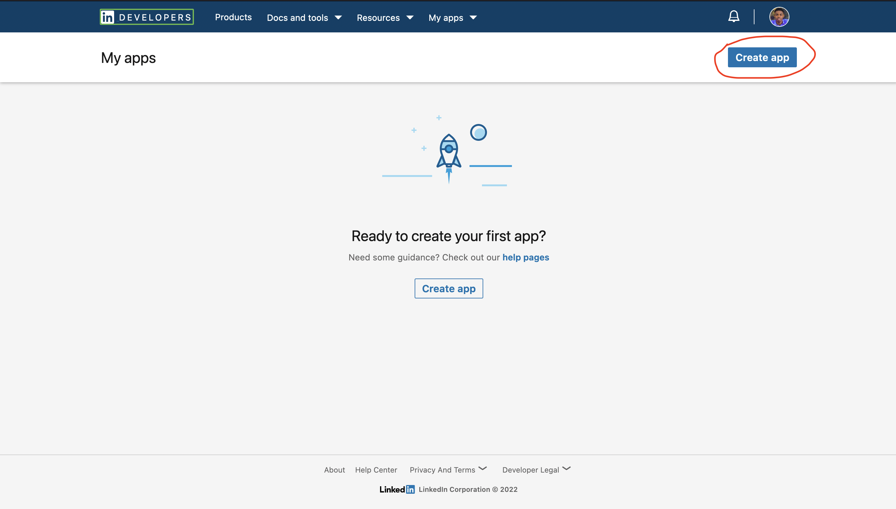
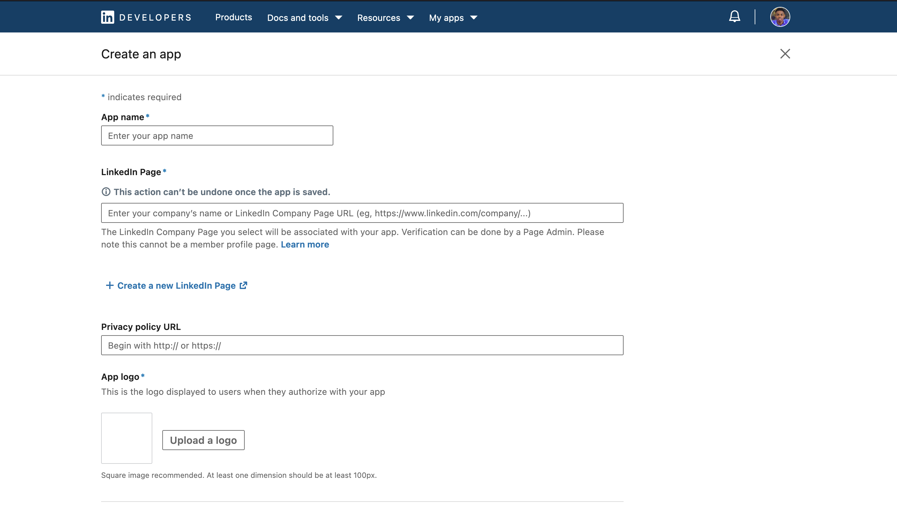
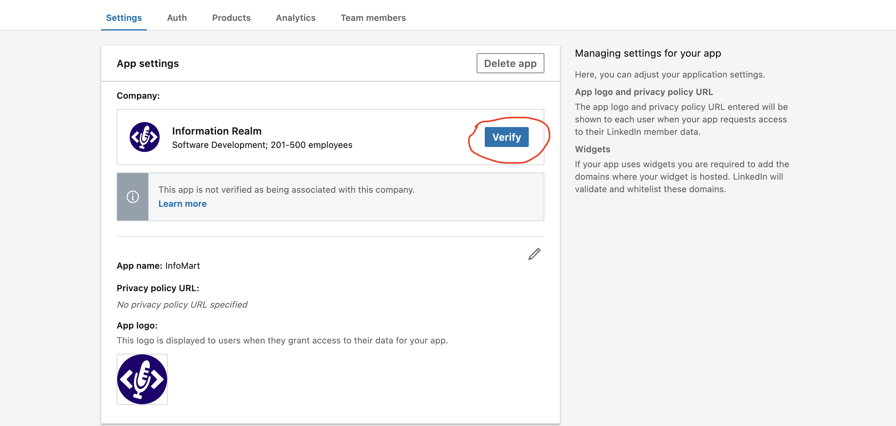
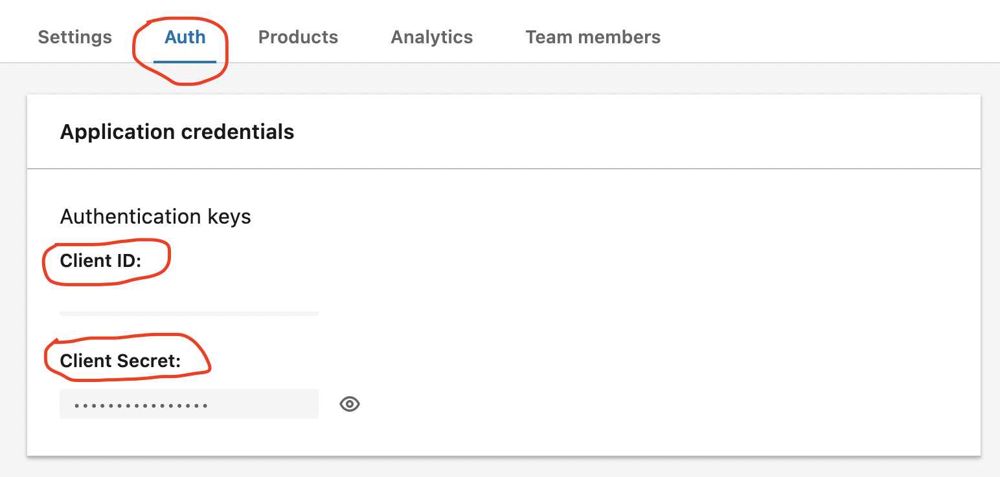
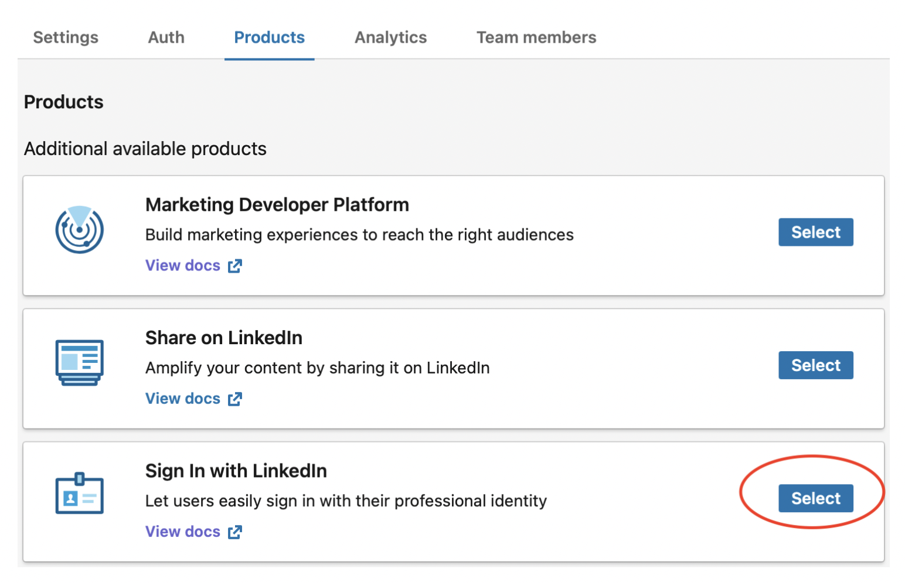
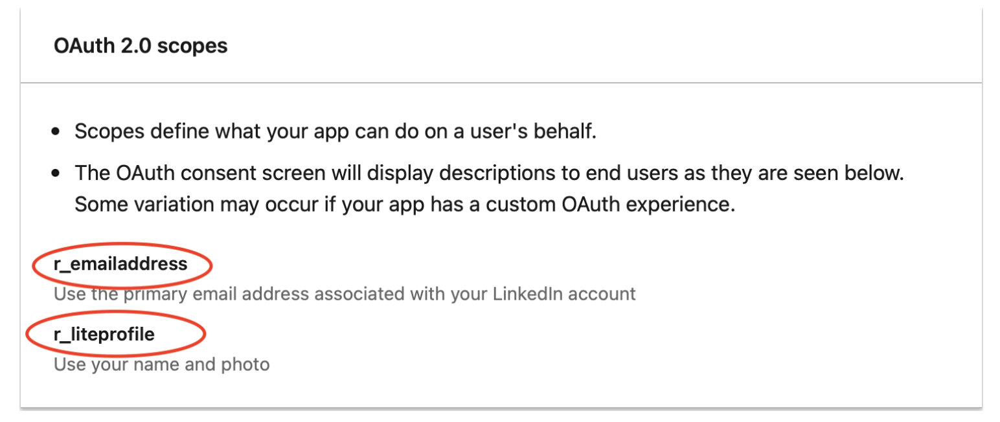
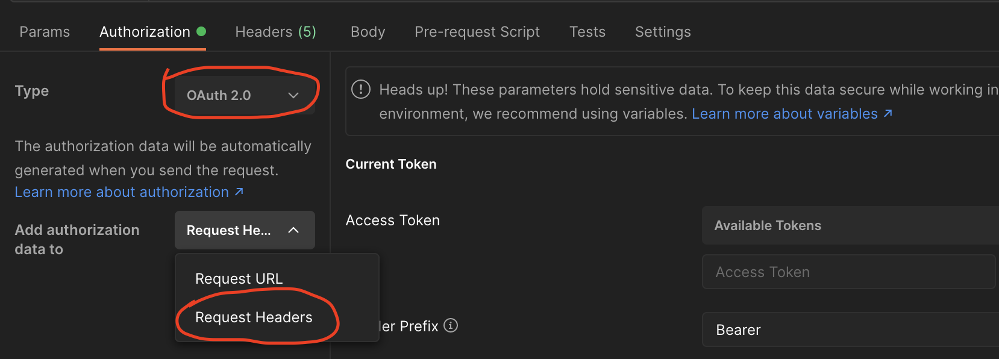
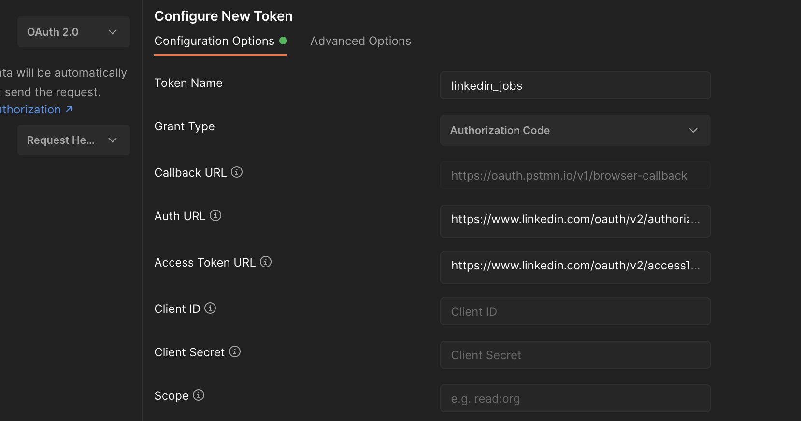

# 
  LinkedIn Jobs API 

LinkedIn is a powerful professional social network. It is a perfect source of professional information and job postings.
Given the significance of its data, LinkedIn has since
<a href="https://developer.linkedin.com/blog/posts/2015/todays-changes" target="_blank">
    2015 disabled public access to their API.
</a>

 You need to be a [Linkedin Partner](#legal-requirements) in order to access the official LinkedIn API.

 

## What you will learn from this article

- [What you can use LinkedIn Jobs API for](#what-you-can-use-linkedin-jobs-api-for)
- [Getting started.](#getting-started)
- [Getting Access to LinkedIn APIs](#getting-access-to-linkedin-apis)
- [Fetching a list of jobs](#fetching-a-list-of-jobs)
- Getting job details
- Limitations of LinkedIn Jobs API

 
 

## What you can use LinkedIn Jobs API for
The **LinkedIn Jobs API** allows users to automatically post jobs to LinkedIn from their **Applicant Tracking System (ATS)**, instead of manually posting via their LinkedIn Recruiter account. Recruiter clients who currently use a job distribution tool typically use this API.
It enables them to simultaneously post jobs to LinkedIn and other websites.
ATS partners no longer need to be authenticated to post on behalf of clients.

 
 

## Getting Started

The LinkedIn API uses [OAuth 2.0](https://oauth.net/2) for user authorization and API authentication. Applications must be authorized and authenticated before they can fetch data from LinkedIn or get access to member data. Most permissions and partner programs require explicit approval from LinkedIn. Open Permissions are the only permissions that are available to all developers without special approval. You can find the complete guide on how access LinkedIn APIs [here](https://docs.microsoft.com/en-us/linkedin/shared/authentication/getting-access?view=li-lms-2022-07).

The **LinkedIn Jobs API** allows authorized third parties such as clients, ATS systems, and job distributors to post jobs directly to LinkedIn on behalf of customers. This article provides instructions for integrating with LinkedIn's Jobs API.

The link below will take you to LinkedIn's Postman's workspace. Select the workspace with the name  `LinkedIn Talent Solutions`, you will find the `Job Posting` API collection in it.

[**LinkedIn Postman workspace**](https://www.postman.com/linkedin-developer-apis?tab=workspaces)

### Legal Requirements

#### Note:
- The use of these APIs is restricted to those developers approved by LinkedIn. Please reach out to your LinkedIn Relationship Manager or Business Development contact as you will need to meet certain criteria and sign an API agreement with data restrictions in order to use this integration.
- Complete the [LinkedIn Talent Solutions Partner Request Form](https://business.linkedin.com/talent-solutions/ats-partners/partner-application) if you are not yet a LinkedIn Talent Solutions Partner.

 
 

## Getting Access to LinkedIn APIs

#### Request Access

Before beginning development, you will need to be provisioned access to test resources, and your API apps need to be set up to access the job posting API endpoints. These can be done by completing the following steps:

 ### Create your LinkedIn application

[Create your LinkedIn application](https://www.linkedin.com/developer/apps) for the integration. Two API applications may be created for each integration: one for use in production and the other for testing and development. Please, request to fill out the Partner Onboarding Form by contacting your LinkedIn Business Development point of contact.

> If you've already created your app, you can skip this step. Otherwise, click on the **Create app** button. If creating an app, you will need a LinkedIn page to link the App. You can easily create one through LinkedIn if you do not have one.

 ### Verify your App

You need to verify your App before moving to the next steps. Actually, without verifying, you won't be able to move forward.

### Get Your Client ID and Client Secret

Once you have your App ready, it's time to get the Client ID and Client Secret. Click on the App from the dashboard and navigate to the Auth tab. Under Application credentials, the *Client ID* and *Client Secret* are present. These are needed for the LinkedIn API.

### Get Your Client ID and Client Secret

LinkedIn has made adding app permissions easier by defining them as products. Go on to the Products tab and click the select button on Sign In with LinkedIn.

After the Sign In with LinkedIn product is successfully added, your **App's OAuth 2.0 scopes** will reflect the new permissions granted. Simply go to the Auth tab and scroll down to the bottom.

### Getting LinkedIn Access Token

You can do this through your browser or an application like Postman. If you decide to use Postman and have never used it before, you can get it on [Postman's](https://postman.com) official website. Now, follow these steps:

- Create your Collection;
- Go to Authorization tab, on the Type selector, select OAuth 2.0 and Add auth data to Request Headers:

- Go to *Configure New Token*, the bottom of the page. Set *Token Name* {Whatever you decide} - *Grant Type*: Authorization Code
- *Auth URL*: [https://www.linkedin.com/oauth/v2/authorization](https://www.linkedin.com/oauth/v2/authorization)
- *Access Token URL*: [https://www.linkedin.com/oauth/v2/accessToken](https://www.linkedin.com/oauth/v2/accessToken)
- *Client ID*: (the Client Id on the LinkedIn App you created, you can find it in the Auth tab)
- *Client Secret*: (on the LinkedIn App, Auth tab > Application keys}
- Scope: *r_emailaddress* *r_liteprofile* (based on the LinkedIn App Authorization)
- State (anything, I used something unique like: *DCEeFWf45A53sdfKef424*)
- Click on **Get New Access Token Button**

> We are almost done, just a few more steps 😉

After you click the **Get New Access Token Button**, a browser window will open up asking for your LinkedIn credentials. Follow the steps presented in the browser to get your Token in your Postman collection as a result.

## And that's it! Let's make sure it's working:

In your collection, create three GET requests to test if your *sign-in* with LinkedIn is working.

- Member Profile: https://api.linkedin.com/v2/me

- Member Profile Picture: https://api.linkedin.com/v2/me?projection=(id,firstName,lastName,profilePicture(displayImage~:playableStreams))

- Member Email Address: https://api.linkedin.com/v2/emailAddress?q=members&projection=(elements*(handle~))

Remember to set the Authorization for each GET request as *Inherit auth from parent* (it should be the default). There are many other APIs you can call using your access token. Check out what LinkedIn has to offer in their [documentation](https://docs.microsoft.com/en-us/linkedin/shared/integrations/people/profile-api).

## You're done!

 
 

## Fetching a list of jobs

Firstly, let's take a look at how LinkedIn displays jobs on its website.

We can easily see from the above gif, how we can see jobs and their details on Linkedin. On the left side, we can see the job names, company names, their locations, etc. And on the other side, we can see the job description.

To use the job listings endpoints in LinkedIn's API, go back to [**LinkedIn Postman workspace**](https://www.postman.com/linkedin-developer-apis?tab=workspaces)

# md-sample
# md-sample
